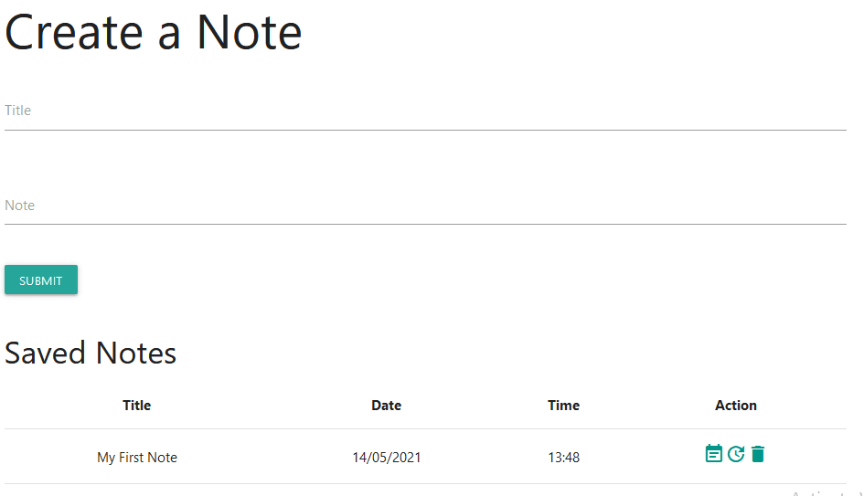

# Save-note-application
Note application written in PHP programming language.      
This is a simple note project that can help the user store their notes.

## Functionalities
* Allows the user to create an account
* Allows user to create a note
* Allows user to update and even delete his or her own notes    

&nbsp;  

&nbsp;  

## Technologies
* PHP version 8

## Installation
You can clone this repository to your computer using the `git clone` command  

## License
This project is available under the [MIT License](LICENSE)
